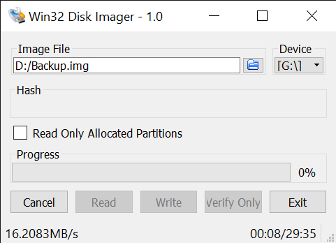
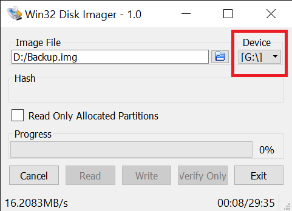
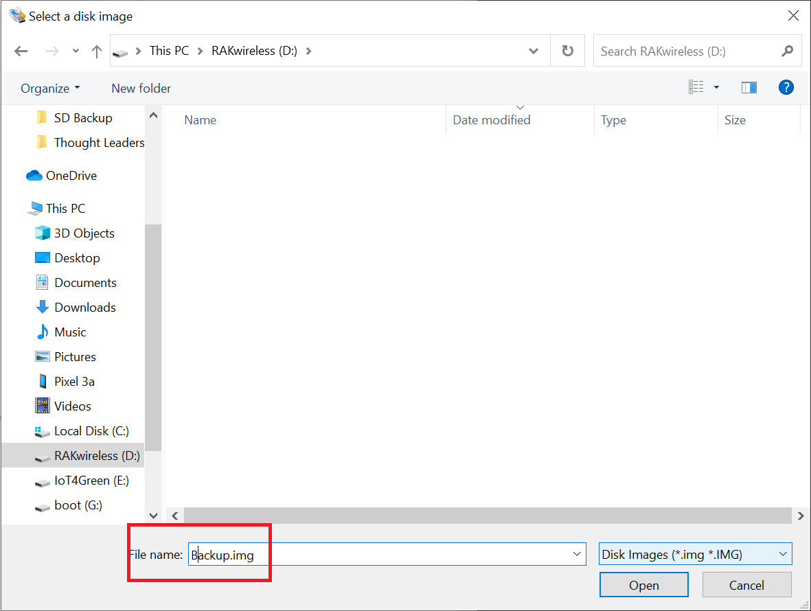
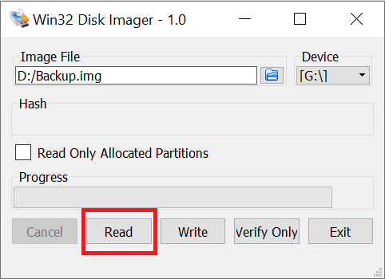
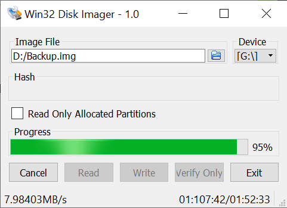
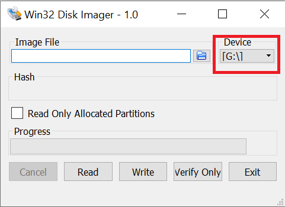
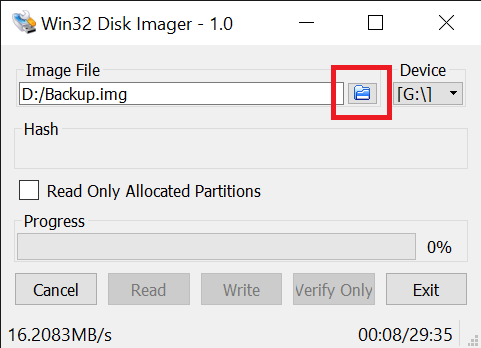
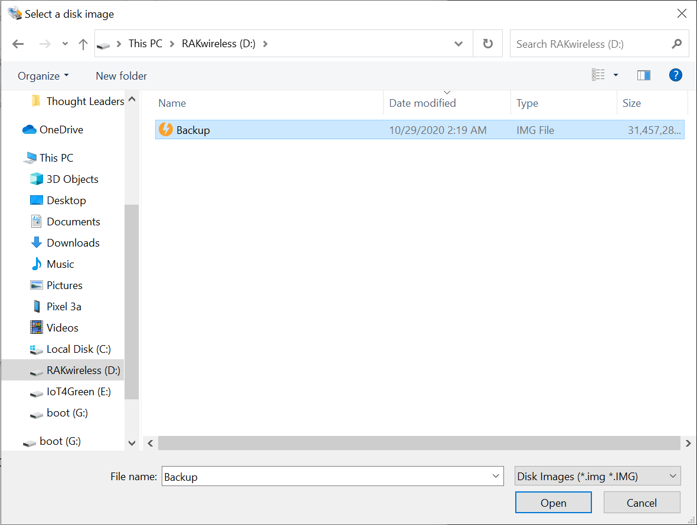
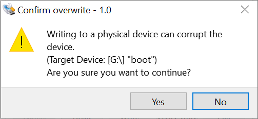
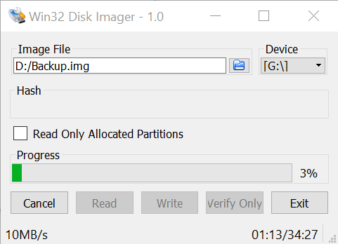

# Back up your SD card on Windows

Requirements:

A micro SD card

A micro SD card reader

MacOS capable hardware

SD Clone

## Backing up

Start by downloading [**win32diskimager**](https://win32diskimager.download/download-win32-disk-imager/) from their official homepage. Unzip the archive and install.

When done start up and you will be greeted by the screen below:

The interface is minimalistic and easy to use.

First select the drive letter corresponding to the drive where your card is. This is where the image will be copied from.

Next you need to provide a path to the file the data is going to be backed in. You can do this either by entering it manually in the text box or clicking the folder icon.

 If you choose the second option you need to navigate to the location and still enter a name in the text box. Make sure you add the "img" extension to the file. Click the "Open" button.

Finally with the path and filename set, start the backup process by pressing the "Read" button.

The progress bar will start filling up, indicating the level of completion of the procedure. Depending on your image size and cad speeds, the time to completion will vary, so be patient.

## Restoring

The restoration procedure is even more streamlined than the backup.

Select the drive you want to flash the backup file to. Make sure you have the correct drive letter.

Navigate to your file either via the folder button or directly enter the a path in the text box.

Confirm at the prompt with the "Yes" button.

Wait for the process to finish and you are done. You can monitor progress via the bar.

